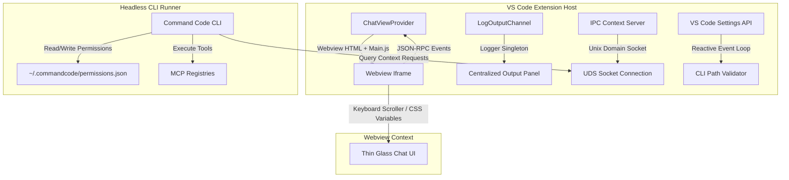

# Architectural Playbook: CMD Lite

This document serves as the authoritative, comprehensive **Architectural Playbook** for the **CMD Lite** project. It outlines our design philosophies, systems architecture, coding standards, and verification guidelines.

---

## 🧠 Core Philosophy: Rich Hickey's Simplicity

CMD Lite is designed according to **Rich Hickey's Simplicity** guidelines (i.e. *decomplecting* concerns). We reject the traditional approach of building "easy" (convenient but complected) extensions that pack complex state, heavy framework lifecycles, and direct execution dependencies inside the editor process.

To maintain simplicity, we strictly categorize and manage our application components as:
*   **Values**: Immutable facts represented as data structures (e.g. editor coordinates, current git commit hashes, file diagnostics, user taste preferences).
*   **State**: The dynamic value of a system component at a specific point in time (e.g., active socket connection pool, current draft inputs).
*   **Identity**: Logical entities whose states evolve over time as a succession of values (e.g., sessions, active permissions).

---

## 📊 Architectural Feature Set Matrix

Below we contrast CMD Lite's de-complected architecture with typical heavy editor extensions (like standard Copilot/Kilo Code wrappers).

| Domain | Typical Heavy Extension (Complected) | CMD Lite Architecture (Decomplected) | Strategic Benefits | Trade-offs |
| :--- | :--- | :--- | :--- | :--- |
| **Visual Rendering** | **Framework-Driven (React/SolidJS)**<br>Local state, component lifecycles, virtual DOM sync. | **"Thin Glass" Vanilla JS**<br>Stateless document rendering, direct DOM projection. | Zero dependency bugs, instant loading, absolute decoupling from React memory leaks. | Manual DOM projection logic and custom regex tokenizers. |
| **Context Extraction** | **Direct Extension Host APIs**<br>Synchronous editor checks blocking LLM generation loops. | **IPC UDS Socket Server**<br>Asynchronous, newline-delimited JSON-RPC over Unix sockets. | CLI runs identically in editor, terminal, or CI/CD pipelines. | Serialization overhead; Unix socket lifecycle management. |
| **Tool Execution** | **Custom bundled Javascript**<br>Executing code inline inside extension processes. | **Model Context Protocol (MCP)**<br>Dynamic runtime resolution via playbooks and standard servers. | Extensible tool set; zero extension binary maintenance. | Requires node/npm environment during first run. |
| **Security Layer** | **Extension Memento Database**<br>GlobalState locks permissions to a single editor instance. | **Shared Filesystem Database**<br>JSON-serialized permission files in `~/.commandcode/permissions.json`. | Unified security profile across headless runs, terminals, and multiple IDEs. | Directory access rights and filesystem collision handling. |
| **Code Validation** | **Compile-time assertions (`as any`)**<br>Assuming payload structures under TypeScript. | **Strict Runtime Narrowing**<br>Type guard functions validating inputs at boundaries. | Bulletproof communication; prevent runtime JSON parse crashes. | Minor boilerplate code validation blocks. |

---

## 🗺️ System Architecture

The following diagram illustrates how the CLI (`cmd`) communicates with the VS Code extension host and webviews over secure, decoupled boundaries.



---

## 📦 Core Component Modules Playbook

### 1. Thin Glass Webview View System
*   **Location**: [src/webview/main.ts](file:///Users/moe/Desktop/cmd/src/webview/main.ts), [src/webview/style.css](file:///Users/moe/Desktop/cmd/src/webview/style.css)
*   **Rules**:
    *   **Zero Authoritative State**: Do not store state in JS variables. If state changes, serialize it to `vscode.setState()` and redraw the DOM projection based on events.
    *   **CSS-Driven Panel Routing**: Switch panels (Chat, Sessions, Status, Agents) by toggling the `panel-active` class. Reject JS routers.
    *   **Theme Integration**: Bind custom scrollbars to native VS Code CSS variables:
        ```css
        ::-webkit-scrollbar-thumb {
          background: var(--vscode-scrollbarSlider-background, rgba(121, 121, 121, 0.4));
        }
        ```
    *   **Nested Scroll Containment**: Always add `overscroll-behavior: contain;` on nested log/diff widgets to prevent scroll chaining.
    *   **Keyboard Navigation**: Intercept scrolling keys (`PageUp`/`PageDown`/`Ctrl+Arrows`) inside inputs and routing global events on `BODY` to the active viewport container via `getActiveScrollContainer()`.

### 2. Context Server (Unix Domain Socket)
*   **Location**: [src/context/ipc-server.ts](file:///Users/moe/Desktop/cmd/src/context/ipc-server.ts), [src/context/protocol.ts](file:///Users/moe/Desktop/cmd/src/context/protocol.ts)
*   **Rules**:
    *   **Unix Domain Sockets**: Communication is strictly over Unix sockets (or local named pipes on Windows).
    *   **Data Boundaries**: Enforce strict type guards (`isIpcRequest`, `isIpcMessage`) on all incoming string buffers. Do not use type assertions (`as any`).
    *   **Stateless Connection Lifecycle**: Do not assume sockets persist. Design all queries to be transaction-based.

### 3. Decoupled Permission Gate
*   **Location**: [src/permission/gate.ts](file:///Users/moe/Desktop/cmd/src/permission/gate.ts), [src/permission/store.ts](file:///Users/moe/Desktop/cmd/src/permission/store.ts)
*   **Rules**:
    *   **Shared Filesystem Database**: Read and write configurations to `~/.commandcode/permissions.json`.
    *   **Atomic Operations**: Ensure all updates are atomic (using temporary file swaps) to prevent read/write conflicts between concurrent agents.

### 4. Logging & Diagnostics
*   **Location**: [src/logger.ts](file:///Users/moe/Desktop/cmd/src/logger.ts)
*   **Rules**:
    *   **Centralized Output**: Implement all diagnostics via a singleton `Logger` wrapping VS Code's `LogOutputChannel`.
    *   **No Scattered Output Channels**: Never call `createOutputChannel` inline inside modules. This complects logging lifecycle with code execution and leaks memory.

---

## 🛠️ Tooling & Scripts Playbook (Babashka Enforced)

We enforce standard workspace scripts using **Babashka (clojure script)** rather than Python, to match our LISP heritage and Clojure-based codebase.

### 1. Package Manager Enforcement
*   **Path**: [scripts/enforce-package-manager.clj](file:///Users/moe/Desktop/cmd/scripts/enforce-package-manager.clj)
*   **Rules**: All dependency installs must run through `pnpm`. Attempting to install via npm, Yarn, or Bun will trigger preinstall failure warnings.

### 2. Git Hooks Configuration
*   **Path**: [scripts/install-hooks.clj](file:///Users/moe/Desktop/cmd/scripts/install-hooks.clj)
*   **Rules**: Pre-commit hooks run automated unit testing, formatting check, and typescript compilation verification using `pnpm` before allowing commits.

### 3. Pre-flight Publishing Verification
*   **Path**: [scripts/publish.clj](file:///Users/moe/Desktop/cmd/scripts/publish.clj)
*   **Rules**: Validates that the git tree is clean, builds the codebase, runs linter and unit tests, compiles the package, and optionally publishes the same single VSIX package to both VS Code Marketplace and Open VSX Registry, preventing duplicate build variance.

---

## 🔬 Quality Verification Checklist

### 1. Automated Tests
*   Run unit tests inside [src/__tests__/](file:///Users/moe/Desktop/cmd/src/__tests__/) using Vitest:
    ```bash
    pnpm test
    ```
*   Run compilation/types check:
    ```bash
    pnpm typecheck
    ```

### 2. CI/CD Pipeline Verification & Gotchas
*   **Package Manager Compliance**: All pipelines must run strictly through `pnpm` (never `npm` or `yarn`).
*   **Node.js Engine Support**: Running pnpm version 11 in CI/CD requires Node.js `22.x` or higher (due to dependencies on native `node:sqlite`). Using older Node runtimes triggers execution crashes.
*   **Preinstall Check Hook dependencies**: Because package installation runs validation scripts utilizing Babashka, CI runners must install the Babashka toolchain before calling `pnpm install`.
*   **Build Order Alignment**: Automated tests (such as webview regression tests) assert assets generated in compilation (e.g. `dist/webview/style.css`). Always execute `pnpm run build` prior to running the test suite in CI to prevent `ENOENT` crashes.

### 3. Manual Visual Tests
*   Verify focus behaviors: Arrow keys and PageUp/PageDown must scroll the chat window when focused inside inputs and on background panel zones.
*   Verify theme colors: Contrast must adapt dynamically when changing workbench themes.
*   Verify nested scrollbars: Confirm nested scrollbars do not pass scroll events to the outer parent layout when boundary is reached.

